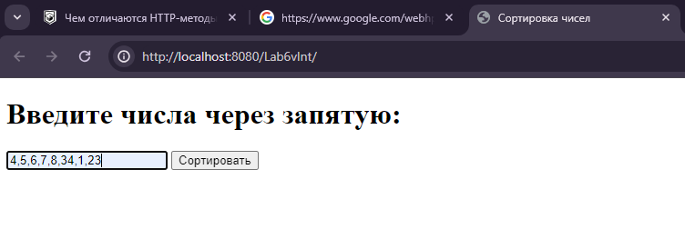
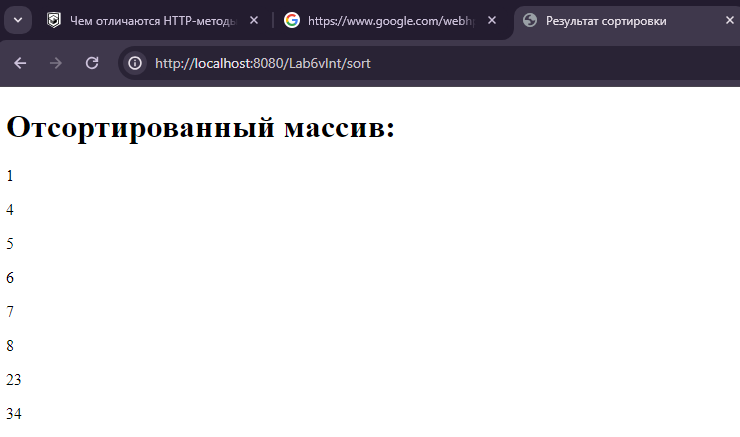

# Lab6_2
Создать сервлет и взаимодействующие с ним пакеты Java-классов и HTML-документов. Готовое веб-приложение разместить на сервере Tomcat (см. "Установка и настройка TomCat").
Осуществить сортировку введенного пользователем массива целых чисел. Числа вводятся через запятую.

